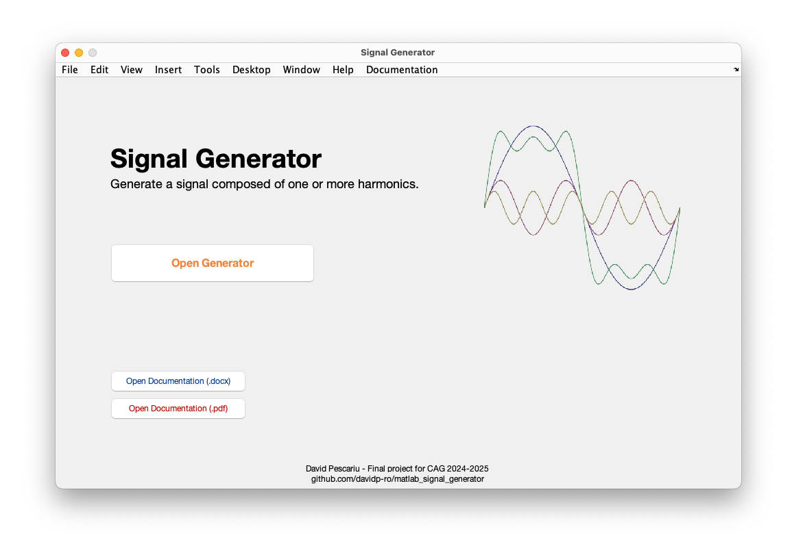
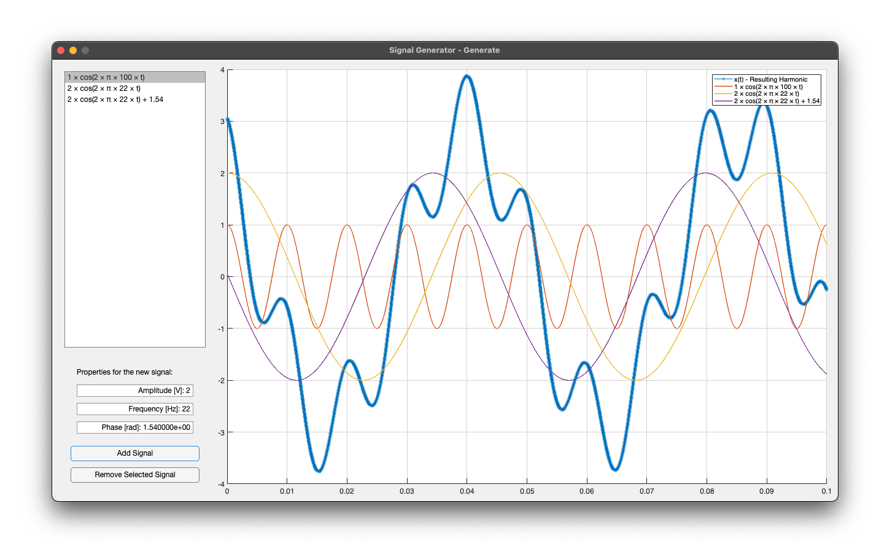

# matlab_signal_generator

Visualize harmonic signals and how they can be used to create a resulting harmonic - essentially generate any waveform, composed of a sum of simple $x(t) = A * cos(2 * π * f * t) + ϕ$ equations.

## Screenshots

**Home/Title Page**

**Generator Page**

## More Info

For more details including usage info, credits and citations, see the [documentation](lib/Signal%20Generator%20-%20Documentation.pdf).

This project is licensed under the MIT License - see the [LICENSE](LICENSE) file for details.
